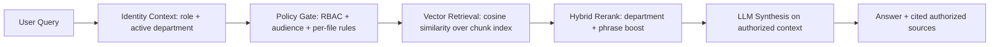

<div align="center">
  
  <h1>🏛️ SAG (Subset-Augmented Generation): Deterministic RBAC-first Retrieval</h1>
  <p><b>Hybrid Vector + Deterministic Retrieval for the LLM OS Era</b></p>
  <p><i>Repository documentation is maintained in English.</i></p>
</div>

<br>

> *"An LLM is the CPU of an emerging operating system."* — **Andrej Karpathy**

### 💡 Inspiration: Standing on the Shoulders of Giants
This project exists because of **Andrej Karpathy's** brilliant vision of the "LLM OS". He proposed that an LLM shouldn't just be a chatbot, but the core processor of a new operating system—capable of reading files, managing memory, and respecting user permissions natively.

As AI architectures evolved, many teams prioritized semantic retrieval first. SAG focuses on a complementary requirement for enterprise systems: **a deterministic, permission-aware file and policy layer**.

**SAG (Subset-Augmented Generation)** is my practical implementation of that missing layer.

---

## Table of Contents

- [What V2 solves](#what-v2-solves)
- [Architecture flow (at a glance)](#architecture-flow-at-a-glance)
- [V3 hybrid architecture (SAG + RAG)](#v3-hybrid-architecture-sag--rag)
- [V3 retrieval mode (recommended)](#v3-retrieval-mode-recommended)
- [V3 operations and observability](#v3-operations-and-observability)
- [When to use SAG vs RAG vs Hybrid](#when-to-use-sag-vs-rag-vs-hybrid)
- [5-minute evaluator demo](#five-minute-evaluator-demo)
- [Data privacy, knowledge, and GitHub boundaries](#data-privacy-knowledge-and-what-belongs-on-github)
- [Quick start and operations](#quick-start-and-operations)
- [Organization model and RBAC subset rules](#organization-model-silos-roles-ceo--operational-staff-and-cross-merge)

---

## 🧪 Design Objective
**SAG is a practical proof-of-concept for deterministic, policy-aware retrieval in high-security environments.**

This repository is provided as an open-source foundation. You are free to take this architecture, adapt it, integrate it with your enterprise's complex RBAC (Active Directory, OAuth, etc.), and scale it for your own needs.

*The framework is public and intended as a practical starting point.*

---

## ⚖️ Retrieval Strategy Context
For many enterprise document workloads, **precision, access control (RBAC), and auditability** are first-order requirements.
This repository provides a deterministic baseline that can be combined with other retrieval strategies when needed.

SAG V2 intentionally starts with deterministic subset retrieval so behavior is easier to reason about and verify:
1. **Lower semantic drift risk in retrieval:** strict metadata/keyword gating limits loosely-related matches.
2. **RBAC-first execution:** policy filters run before synthesis.
3. **Operational clarity:** teams can inspect and audit source selection directly.

## 🧠 Enter "The Subset Theory"
SAG V2 prioritizes **The Subset Theory** as the baseline retrieval strategy.

Instead of converting your company's knowledge into billions of unreadable numbers, we flip the architecture:

1. **Deterministic Scouting:** We use high-speed, multi-threaded worker bots to filter and extract the most relevant **"Subset"** of data using deterministic metadata, tags, and keyword swarms over a Markdown vault.
2. **The LMM as a Synthesizer:** Once the perfect "Subset" is isolated, we feed *only* that pristine data to the Large Multimodal Model (LMM). The LMM's only job is to reason and synthesize the final answer.
3. **Zero-Trust by Default:** Because the search happens at the OS file-system level, Role-Based Access Control (RBAC) is native. If a user doesn't have OS-level clearance for a folder, the worker bots simply don't see it. Zero data leakage.

## 🛡️ Practical Simplicity
*This architecture favors deterministic techniques (metadata + keyword filtering) before synthesis, with a focus on controllability and auditability.*

## 🚀 Features
- **Deterministic baseline retrieval:** metadata + keyword subset strategy, built for policy control.
- **100% Native RBAC:** Inherits your organizational silo permissions automatically.
- **Reduced retrieval hallucination risk:** if deterministic search cannot find matching sources, synthesis is constrained accordingly.
- **Multi-threaded Speed:** Parallel worker agents (optimized swarm) scout the vault in milliseconds.
- **Industrial Resilience:** Integrated safety cut (circuit breaker) and industrial operational watchdog.
- **Demo Audit Layer:** AI-on-AI QC judging and performance dashboard (built for continuous improvement).
- **Layered cross-silo access for VPs:** Department Heads can receive *merged* silo search scope with per-file policies (whitelist / deny / substring rules) — see **§ Organization model** below.
- **Identity-first question drafting:** GURU shows a role-scoped document preview table before prompting, so users can draft questions from only the documents they are authorized to see.
- **Ops alert relay:** Optional LINE and Discord webhook notifications for critical runtime/API failures.
- **V3 Vector pipeline:** `VectorIndex` with token-set cosine similarity (zero-dependency, no external model required) — chunks `.md` files into `knowledge/_vectors/` and searches via cosine similarity.
- **V3 Vector pipeline (ONNX optional):** Dense embedding support via `all-MiniLM-L6-v2` (`sentence-transformers`) — toggle with `SAG_ENABLE_ONNX_EMBEDDING=true`. Benchmark shows identical accuracy to token-set at 4× RAM cost; default-off.
- **V3 Phase D.2 — R&C soft-penalty:** 30% score reduction for Risk & Compliance documents when query targets a different department.
- **V3 Phase F — LLM keyword cache:** Persisted query → keyword mapping eliminates redundant Gemini API calls on repeat queries.

## 🎯 What V2 solves

V2 focuses on enterprise-safe retrieval with measurable operating behavior:

- **Deterministic retrieval:** source inclusion is based on explicit metadata, folder scopes, and policy rules.
- **RBAC-first gating:** role + active department + per-file rules are enforced before synthesis.
- **Auditable response path:** users can inspect authorized source files used in answer generation.
- **Operational repeatability:** runbook-driven startup, recovery, and cache/index rebuild flow.

## 🔁 Architecture flow (at a glance)



## 🧭 V3 hybrid architecture (SAG + RAG)

V3 architecture draft and diagram are available at:

- `docs/ARCHITECTURE_V3.md`

V3 pipeline:

```
User Query
  → LLM generate_keywords (Gemini 2.5 Flash)
  → Keyword dedup + synonym expansion (Phase D.2)
  → Department anchor/disambiguation
  → VectorIndex.query()  ← token-set cosine similarity on content chunks
  → HybridSearch.rerank()  ← department/phrase boost + R&C penalty
  → Final LLM synthesis
```

**Key difference from V2:** V3 uses `VectorIndex` as the primary retrieval mechanism (no `.md` lexical scanning). All documents are chunked and stored as token-set vectors in `knowledge/_vectors/`. ONNX dense embeddings (`all-MiniLM-L6-v2`, 384-dim) can be enabled via `SAG_ENABLE_ONNX_EMBEDDING=true` (benchmarked at 86.0% / 100Q — identical to token-set; default-off due to 4× RAM cost).

## ⚙️ V3 retrieval mode (recommended)

Current recommended enterprise path in this repository:

1. **Keyword Swarm** (LLM keyword expansion + fallback query tokens)
2. **Vector Index Search** (cosine similarity over token-set vectors from `knowledge/_vectors/`)
3. **Dynamic Re-rank** on candidate set (department aware, R&C soft-penalty)
4. **Final synthesis** on authorized context

### Runtime settings

Configure in **System Config → Retrieval architecture** (or env):

| Variable | Default | Purpose |
|----------|---------|---------|
| `SAG_ENABLE_HYBRID` | `true` | Enable hybrid rerank pipeline |
| `SAG_HYBRID_STRATEGY` | `dynamic_rerank` | `vector_plus_rerank` or `dynamic_rerank` |
| `SAG_HYBRID_TOP_K` | `5` | Documents returned after rerank |
| `SAG_HYBRID_ALPHA` | `0.65` | Lexical vs semantic weight in hybrid score |
| `SAG_ENABLE_ONNX_EMBEDDING` | `false` | Enable ONNX dense embeddings (requires `sentence-transformers`) |

Keyword cache: enabled by default (persisted to `cache/llm_keywords_cache.json`)

## 📈 V3 operations and observability

### Vector index

V3 chunking/indexing writes to `knowledge/_vectors/`:

| File | Content |
|------|---------|
| `_chunks.json` | All chunk metadata (740 chunks for demo vault) |
| `_index.json` | Token-set vector index for cosine similarity search |

### Keyword resilience

The orchestrator supports synonym-assisted expansion via:

- `config/domain_synonyms.json`

This improves recall when user wording differs from policy vocabulary.

### Retrieval trace logging

Each request appends one JSON line to:

- `logs/retrieval_trace.jsonl`

Tracked fields include:

- mode, role, scope, keyword count, source count
- timing per stage: keyword generation, vector search, rerank, synthesis, total

### Test reports

- V2 baseline: `docs/TEST_REPORT_V2.md`
- V3 vector pipeline: `docs/TEST_REPORT_V3.md`
- Metadata schema: `docs/METADATA_SCHEMA.md`

## 🧩 When to use SAG vs RAG vs Hybrid

| Mode | Best for | Strengths | Trade-offs |
| :--- | :--- | :--- | :--- |
| **SAG only** (deterministic lexical + RBAC) | Policy-heavy enterprise docs, strict audit requirements | Predictable, explainable, RBAC-first, low drift | Lower semantic recall for loosely phrased questions |
| **RAG only** (semantic/vector-first) | Broad semantic discovery, fuzzy knowledge exploration | High semantic recall, good for paraphrase-heavy queries | Harder governance/audit, potentially higher infra cost |
| **Hybrid** (SAG V3 default) | Enterprise workloads needing both safety and recall | Subset ACL control + vector cosine similarity + dynamic rerank | Token-set cosine limited on short docs; ONNX embeddings pending |

## ⚡ 5-minute evaluator demo

Use this path when you need to show value quickly:

1. Start app with demo data (`demo_knowledge` copied to `knowledge`).
2. Open `Start`, set provider + API key.
3. In `GURU Assistant`, select:
   - `Operational Staff` in one silo, ask a policy question.
   - `Department Head` in the same silo, ask the same question.
4. Compare `Documents available to this identity` and answer citations.
5. Open `View Authorized Sources` to confirm deterministic, role-scoped retrieval.

Expected demo outcome: stronger roles see broader authorized context while staff remains silo-constrained.

## 📏 V2 success metrics (recommended)

- **Policy violation count:** 0 unauthorized source exposures in role regression tests.
- **Subset precision:** high share of returned sources belong to role-authorized scope.
- **Latency:** track p50/p95 from query input to final answer.
- **Operational reliability:** successful startup and index rebuild in local + Docker paths.

---

## 🛡️ Data privacy, `knowledge/`, and what belongs on GitHub

> [!WARNING]
> **Public GitHub = application code only.** Treat your Markdown vault as **data**, not as part of the public template.

| Location | Typical contents | On public GitHub? |
| :--- | :--- | :--- |
| Repo root (`app.py`, `core/`, `docs/`, Docker files, `config/.env.example`) | Orchestration, UI, docs | **Yes** — safe to push |
| `config/.env` | API keys, tokens | **Never** — gitignored; copy from `config/.env.example` |
| `knowledge/` | Markdown silos ("vault"), RBAC-sensitive text | **No** (default) — `.gitignore` keeps it local / on your machine only |
| `raw_data/` | Drop zone for ingestion | **No** — gitignored |
| `logs/` | Runtime / audit JSON | **No** — gitignored |
| `.obsidian/` | Obsidian workspace metadata | **No** — gitignored |

**Why not push `knowledge/` to a public repo?**  
Once pushed, content is **copied forever** across forks, clones, and search indexes. Enterprise playbooks, customer names, or policy drafts do not belong next to open-source code unless you have explicitly cleared legal + security review.

**If you truly need Git-backed vaults:**

- **Private repository** (org-only) + branch protections — still treat as sensitive; rotate anything that ever leaked to a public remote by mistake.
- **Separate private repo** for `knowledge/` only (or Git submodule) so the public SAG repo stays code-only.
- **No Git at all for vault:** keep `knowledge/` on disk, NAS, S3, or Google Drive — the **Docker Compose** setup bind-mounts `./knowledge` and `./raw_data` from the host; the container never required the vault to live inside the image.

**Google Drive / local paths:** Never commit machine-specific absolute paths or synced folders that contain private files.

---

## 👥 Getting the code (evaluators, testers, forks)

You can download and run this project **without being the maintainer**.

| Method | What to do |
| :--- | :--- |
| **Git clone** | `git clone https://github.com/tong-mini-mac/SAG.git` then follow **§ Quick start** below. |
| **ZIP** | On GitHub: **Code → Download ZIP**, extract, then open a terminal in that folder. |

### What testers and evaluators should know

Tell anyone trying the demo the following:

1. **There is no `knowledge/` vault inside the repo.** It is **gitignored** on purpose (**privacy policy** — see **Data Privacy & GitHub Policy** above). After `git clone` or unzipping, **you must supply Markdown yourself**: build **`knowledge/<Department>/`** to match **`config/org_structure.json`**, **or** copy from the repo's **`demo_knowledge/`** into **`knowledge/`** as described in this README (**same folder names as department silos**).

2. **Automatic demo seed (optional):** If **`knowledge/`** has **no** `.md` files yet and **`demo_knowledge/`** exists next to the app, **`maybe_seed_demo_vault`** (`core/Utils.py`) may copy **`demo_knowledge/` → `knowledge/`** on startup. Create **`knowledge/.no_auto_demo`** to disable that behaviour.

3. **API keys (BYOK):** Bring **your own** LLM credentials. Enter them in the Streamlit UI or **`config/.env`** (see **Quick start §2** and **`config/.env.example`**).

4. **Repository access:** If this GitHub repo is **public**, anyone can clone or download the ZIP. If it is **private**, only **invited users** or accounts **granted access** can clone or pull.

**In short:** testers get the **code** via **`git clone`** or **ZIP**. Whether that works **without extra GitHub login** depends on **public vs private**. They always need to **prepare a vault under `knowledge/`** (manually, from **`demo_knowledge/`**, or via **auto-seed**) and **their own API key**.

---

## 🏢 Organization model: silos, roles (CEO → Operational Staff), and cross-merge

The **subset** enforced at query time uses `config/org_structure.json`, `core/Utils.py` (`document_visible_to_viewer`), YAML `audience` in front matter (e.g. `management`), and optional config files listed below.

### Department silos (folder names under `knowledge/`)

These must match the `name` field for each department in **`config/org_structure.json`**.

| Silo | Code | Focus |
|------|------|--------|
| **General** | GEN | Company-wide / HQ policies |
| **Credit & Loans** | CRL | Lending |
| **Operations** | OPS | Branches / operations |
| **IT & Digital** | ITD | Technology & digital |
| **HR & Admin** | HRA | HR & admin |
| **Risk & Compliance** | RSK | Risk & compliance |

### Role → search scope (vault)

| Role | Search scope | Notes |
|------|----------------|-------|
| **CEO** | **ALL** silos | Full vault; still respects YAML `audience` when set. |
| **CFO** | **Credit & Loans**, **Risk & Compliance**, **General** | Fixed list in `org_structure.json`. |
| **CTO** | **IT & Digital**, **Operations**, **General** | Fixed list in `org_structure.json`. |
| **Department Head (VP)** | **Selected department + General** (`subset_include_general: true`) **plus merged silos** (see below) **and** per-file filtering. |
| **Operational Staff** | **Selected department only** (no General by default) | Extra per-department **denylist** in `config/operational_staff_vault_denylist.json`. |

Operational Staff (and roles with a single silo) **do not** see `audience: management` documents unless the role is treated as management in code.

### Cross-silo merge (Department Head only)

For **Department Head (VP)** the app expands the allowed folder list **after** `[department, General]` using, **in order**:

1. `merge_credit_cross_access_subset` → `config/credit_head_cross_access.json`
2. `merge_hr_cross_access_subset` → `config/hr_head_cross_access.json`
3. `merge_it_cross_access_subset` → `config/it_head_cross_access.json`
4. `merge_ops_cross_access_subset` → `config/ops_head_cross_access.json`
5. `merge_risk_silo_cross_access_subset` → `config/risk_silo_cross_access.json`

Each step **appends** a silo folder name when the viewer's active department is in that config's merge list **and is not** the silo owner (no duplicate append). **CEO / CFO / CTO** paths that are already `ALL` or fixed lists **do not** use this merge chain.

**Search** still applies **`document_visible_to_viewer`** per file (whitelist, explicit deny, substring rules, Risk/HR/Ops extras, universal-read basenames, auditee audit-report lists, etc.).

| If the Head's active department is… | Extra silo merged in (when not already that silo) | Mechanism (high level) |
|-------------------------------------|---------------------------------------------------|-------------------------|
| Not **Credit & Loans** | **Credit & Loans** | Credit policy/strategy allowlists; Operations gets extra basenames per `credit_head_cross_access.json`. |
| Not **HR & Admin** | **HR & Admin** | Whitelist + explicit deny (`hr_head_cross_access.json`). |
| Not **IT & Digital** | **IT & Digital** | Whitelist + Risk-only extras + substring deny on basenames (`it_head_cross_access.json`). |
| Not **Operations** | **Operations** | Whitelist + HR substring / Risk expansion + denies (`ops_head_cross_access.json`). |
| Not **Risk & Compliance** | **Risk & Compliance** | Whitelist + IT/Ops AML extras + optional auditee reports per department (`risk_silo_cross_access.json`). |

### Related config files

| File | Purpose |
|------|---------|
| `config/org_structure.json` | Departments & base role access. |
| `config/universal_read_basenames.json` | Basenames readable across allowed silos (extra visibility rules). |
| `config/credit_head_cross_access.json` | Merge Credit + policy/strategy file lists. |
| `config/hr_head_cross_access.json` | Merge HR + cross-read rules. |
| `config/it_head_cross_access.json` | Merge IT + Risk-only extras + deny patterns. |
| `config/ops_head_cross_access.json` | Merge Operations + HR/Risk extensions. |
| `config/risk_silo_cross_access.json` | Merge Risk + AML/auditee rules. |
| `config/operational_staff_vault_denylist.json` | Blocks specific basenames for Operational Staff by silo. |

### Index & regression

- After bulk changes under `knowledge/`, use **🛠️ System Config → Rebuild vault index & search cache** (builds `_SEARCH_CACHE.json`, `_MASTER_INDEX.md`, and vector index in `_vectors/`).
- Example script for merge scope: `scripts/test_merge_cross_silo.py`.

---

## 🛠️ Quick start & operations

**In this section:** (1) two-folder layout & subset rules → (2) first-time steps 1–6 → (3) production checklist → (4) env/CLI notes → (5) tech reference.

Operational references:
- Runbook: `docs/RUNBOOK.md`
- Security policy: `SECURITY.md`
- Contribution guide: `CONTRIBUTING.md`

---

### 1) Two folders, subsets, and where `.md` comes from

Everything below uses defaults from `core/Utils.py`. Override paths with environment variables or **🛠️ System Config** in the app.

| Layer | Path (default) | Config key | What it is |
| :--- | :--- | :--- | :--- |
| **Raw** | `raw_data/` | `RAW_DATA_PATH` | Drop unstructured files here first. |
| **Cleaned** | `knowledge/` | `CLEANED_DATA_PATH` | The **only** tree GURU indexes—your "cleaned data" vault (name can stay `knowledge/`). |

**Automated pipeline (raw → cleaned)**  
With Streamlit running, the **background monitor** watches `raw_data/`. **`DataRefinery`** calls your **LLM** to classify content, suggest a filename, and write **Markdown + YAML front matter** straight into **`knowledge/<Department>/`**. No second staging folder. **Obsidian does not run this step** and never receives raw drops.

**Subset (who sees what)**  
"Subset" is enforced at **query time** in Python: allowed **department folders** under `knowledge/`, using `config/org_structure.json` and the role you pick in the UI (`RAGOrchestrator`). **Department Heads** additionally get **merged silos** and **per-file RBAC** as described in **§ Organization model**. **Obsidian does not split subsets.** Optionally open `knowledge/` in Obsidian **after** files exist to edit, link, or tag—folder names must still match silos.

| How `.md` gets into `knowledge/` | Details |
| :--- | :--- |
| **Refinery (automated)** | `raw_data/` → LLM classification → `knowledge/<Department>/` (monitor or batch `DataRefinery().scan_and_refine_all()`). |
| **Manual** | Create/edit `.md` in VS Code, Cursor, Obsidian, etc. |
| **Office / PDF** | Optional **[Pandoc](https://pandoc.org/installing.html)** if you use Pandoc-based flows; place output under the right silo. |
| **Bulk import** | Copy pre-cleaned trees into `knowledge/`; department folder names must match **`org_structure.json`**. |

---

### 2) First-time run (steps 1–6)

Do these in order for the PoC.

### Quick demo in 30 seconds (for fresh clones)

If you only want to verify that SAG works end-to-end with demo data:

1. Clone and enter the project.
2. Copy `demo_knowledge/` to `knowledge/`.
3. Install dependencies and run Streamlit.

**Windows (PowerShell):**

```powershell
git clone https://github.com/tong-mini-mac/SAG.git
cd SAG
Copy-Item -Recurse .\demo_knowledge .\knowledge
python -m pip install -r requirements.txt
streamlit run app.py
```

**macOS / Linux:**

```bash
git clone https://github.com/tong-mini-mac/SAG.git
cd SAG
cp -R demo_knowledge knowledge
python3 -m pip install -r requirements.txt
streamlit run app.py
```

This keeps sensitive real-world vault data out of GitHub while still giving evaluators a working demo path.

**Mockup knowledge package (Google Drive):**  
[knowledge_mockup_v1.zip](https://drive.google.com/file/d/1yOg5Refv1Yao-N_IXnqnCR2IRpSRffYp/view?usp=sharing)

**1. Install the codebase**

**Option A — Docker (recommended)**

Prerequisites: [Docker](https://docs.docker.com/get-docker/) + [Docker Compose v2](https://docs.docker.com/compose/).

```bash
git clone https://github.com/tong-mini-mac/SAG.git
cd SAG
cp config/.env.example config/.env
# Edit config/.env — set at least GEMINI_API_KEY (or keys for the provider you select in the UI)

mkdir -p knowledge raw_data logs
docker compose up --build
```

Open **http://localhost:8501**

- **Secrets:** real keys live only in `config/.env` (gitignored). Do not commit `.env`.
- **Vault / uploads:** `knowledge/` and `raw_data/` are **bind-mounted** from your host; data persists when the container stops.
- **Compose:** `docker compose` loads `config/.env`; create the file with `cp config/.env.example config/.env` if it does not exist yet.

**Option B — Local Python (same clone + pip as below)**

Requires **Python 3.9+** (the included `Dockerfile` uses **3.11** for the container image).

```bash
git clone https://github.com/tong-mini-mac/SAG.git
cd SAG
pip install -r requirements.txt
```

Optional: create a virtual environment (`python -m venv .venv` then activate) before `pip install`. Optional: install the [Pandoc](https://pandoc.org/installing.html) binary if you rely on Pandoc-based export features (`pypandoc`).

**2. Start the UI**

```bash
streamlit run app.py
```

On Windows, if you maintain a local launcher script (e.g. `start.bat`), you can use that instead—it should `cd` to this folder and run Streamlit with your venv.

**3. Connect an LLM (BYOK)**

1. When the app opens, complete the minimal **API key** step, **or** open **🛠️ System Config** in the sidebar.
2. Choose **Google**, **OpenAI**, or **Anthropic** and paste **your own** API key. Keys stay in the Streamlit session until you close the tab.
3. Optional: click **Save keys to config/.env on this PC** so keys reload on the next run (`config/.env` is gitignored). See `config/.env.example`.

Refinery/raw ingestion **requires** a working key—search and GURU need it too.

**4. Put knowledge on disk — pick one track**

| Track | When to use | What to do |
| :--- | :--- | :--- |
| **A — Trial / cleaned vault** | You already have (or imported) Markdown silos—e.g. demo data, Google Drive sync, manual copy | (1) Folder names under `knowledge/` must match **department `name`** fields in `config/org_structure.json`. (2) Place `.md` files with YAML front matter (`title`, `doc_id`, `tags`, `summary`, …) under `knowledge/<Department>/`. **Obsidian is not required** if files are already there—you can edit with VS Code/Cursor/Obsidian. |
| **B — Raw → cleaned Markdown (automated)** | You have unstructured drops (txt, pasted exports, …) | (1) Ensure step 3 is done—**DataRefinery** calls your LLM. (2) Drop files into **`raw_data/`** (raw). (3) Keep Streamlit running: the **background monitor** writes **`.md` straight into `knowledge/<Department>/`** (cleaned). *(4) Batch alternative from project root (venv active):* `python -c "from core.Refinery import DataRefinery; DataRefinery().scan_and_refine_all()"`. |

Regardless of track, **GURU only reads the cleaned vault** (`CLEANED_DATA_PATH`, default `knowledge/`).

**5. Refresh indexes after bulk changes**

After copying many files or changing paths, open **🛠️ System Config** → **Rebuild vault index & search cache** so `_SEARCH_CACHE.json`, `_MASTER_INDEX.md`, and the vector index in `_vectors/` stay accurate.

**6. Query with GURU**

Open **🧠 GURU Assistant**, choose **role** and **department**, confirm the **document preview table** matches your simulated access, then ask your question in the chat box.

### 2.1) Role-scoped preview flow (recommended)

To avoid cross-silo confusion and improve answer precision:

1. Select **Identity Simulation (role)** and, when needed, **Active Department**.
2. Review **Documents available to this identity (for drafting questions)**.
3. Draft your question from those visible titles / topics.
4. Run GURU query and verify sources in **View Authorized Sources**.

This is the intended "subset-first" operating pattern for the demo.

---

### 3) Production checklist

Use when "trial data" becomes real content. This repo stays a PoC—you own security, deployment, and governance.

1. **Secrets** — Store keys in **`config/.env`** (gitignored), a vault, or your cloud secret manager—never in git. Restrict OS permissions on that file. Rotate API keys per policy.
2. **Vault matches the org model** — Keep **`knowledge/<Department>/`** folder names aligned with **`config/org_structure.json`**. Remember: **filesystem permissions** on those folders are the practical access boundary; sidebar "roles" only **simulate** RBAC inside the demo UI.
3. **Ingestion governance** — Define who may write to **`raw_data/`**. Review **`DataRefinery`** output—the LLM can mis-label a department. After bulk imports or path changes, run **Rebuild vault index & search cache** (System Config). Optionally add a human QA step before treating new `.md` as authoritative.
4. **Paths & hosting** — Set **Raw data** / **Knowledge vault** paths in **System Config** when the vault lives on another drive or share. Run Streamlit **locally**, **behind VPN**, or in a **container / VM** as appropriate; put a **reverse proxy + TLS** in front if exposing beyond localhost.
5. **Monitoring** — Set **`LINE_NOTIFY_TOKEN`** and/or **`DISCORD_WEBHOOK_URL`** in `.env` if you rely on ops alerts from watchdog/monitor paths; verify notifications in lower environments first.
6. **Backups** — Schedule backups of **`knowledge/`**, **`config/`**, and **`logs/`** (and audit artifacts) independently of `git clone`.
7. **Models & spend** — Pin **`GEMINI_MODEL`** / provider equivalents in `.env`; track provider billing and quotas.
8. **Editorial workflow** — For teams maintaining Markdown at scale, standardize on **Obsidian**, **Git**, or internal CMS export into `knowledge/`—pick one workflow and document it for authors.

Complete **steps 1–6** first; then apply this checklist as needed.

---

### Obsidian (optional reminder)

- **Trial with pre-cleaned Markdown:** Obsidian **not required**—the app only reads files on disk.
- **Ongoing editing:** Many teams open `knowledge/` as an [Obsidian](https://obsidian.md/) vault for links/tags/graph; others use VS Code/Cursor. `.obsidian/` remains gitignored.

### 4) Configuration extras (CLI / persistence)

You do **not** need `config/.env` to open the UI—see **§2 step 3** above for BYOK.

- Copy `config/.env.example` → `config/.env` and fill variables, **or** use **Save keys to config/.env on this PC** in the app (`config/.env` is gitignored).
- For **CLI / scripts** without Streamlit, set `SAG_PRIMARY_PROVIDER` to `google`, `openai`, or `anthropic` (same values the in-app save button writes) so the correct API key is read.
- Knowledge source backend is pluggable via `KNOWLEDGE_SOURCE_BACKEND` (default: `localfs` for Obsidian/Markdown folders).
- Optional notifications:
  - `LINE_NOTIFY_TOKEN=...`
  - `DISCORD_WEBHOOK_URL=https://discord.com/api/webhooks/...`

### 5) Tech reference

| Category | Technology | Purpose |
| :--- | :--- | :--- |
| **Packaging** | `Docker` + Compose | Optional reproducible runtime; bind-mount `knowledge/` and `raw_data/` from the host |
| **Orchestration** | `Python 3.9+` (3.11 in Docker image) | Core control logic |
| **Logic Layer** | `Gemini 2.5 Flash` (+ OpenAI / Anthropic optional in UI) | Query interpretation & response synthesis |
| **Vector Index** | Token-set cosine similarity (zero-dependency) | Document retrieval from chunked content |
| **Storage** | Markdown vault (`knowledge/`, Obsidian-compatible) + `_vectors/` index | Distributed silos on disk |
| **UI Framework** | `Streamlit` | Enterprise Guru dashboard |
| **Resilience** | `Industrial Watchdog` | PID lock, auto-recovery, optional LINE/Discord alerts |

---

**Built with respect for the craft.**
*Architected by Vittaya (Bangkok, Thailand).*

*PS: https://www.linkedin.com/in/vittaya-lertbuiasin-13b258149/*