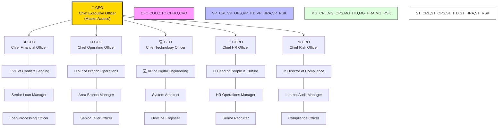

# 🌳 Digital Bank - Family Tree Org Chart (V2)

This chart represents the 5-layer hierarchical structure of the bank, optimized for **RAG-Destroyer** access control and department-level filing.

## 📊 The Banking Family Tree

## 📜 Hierarchy Levels Definition

| Level | Title | Responsibility |
| :--- | :--- | :--- |
| **L1** | **CEO** | Total Bank Oversight & Strategic Mandates |
| **L2** | **C-Suite** | Departmental P&L and Multi-Subset Authority |
| **L3** | **VP / Head** | Tactical Deployment & Subset Quality Control |
| **L4** | **Manager** | Day-to-day Supervision & Ingestion Review |
| **L5** | **Officer** | Direct Data Generation & Customer Interaction |

---
*📍 **Location:** This visual tree is synchronized with `config/org_structure.json` and governs the internal search workers.*
